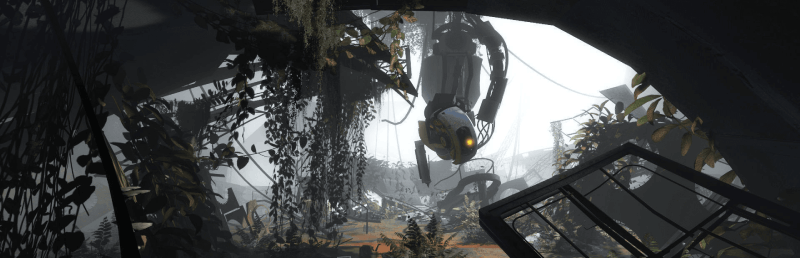

A guide on how to download and install [Portal 2](https://store.steampowered.com/app/620/Portal_2/) **mods** on **Windows** and **Linux**! This includes downloading mods, setting them up through the [Steam Workshop](https://store.steampowered.com/) or using standalone folders, and launching them.

Whether you want to experience fan-made campaigns or build your own test chambers, this guide will help you get started!

## Table Of Contents
* [Requirements](#requirements)
* [Where To Find Mods](#where-to-find-mods)
* [Downloading & Installing Mods](#downloading--installing-mods)
    * [Using Steam Workshop](#using-steam-workshop)
    * [Installing Standalone Mods](#installing-standalone-mods)
* [Conclusion](#conclusion)
* [See Also](#see-also)

## Requirements
* Portal 2 installed on Steam
* Basic folder and file management skills (only for manual installs)
* [7-Zip](https://www.7-zip.org/) (only for manual installs)

## Where To Find Mods
The main source of mods for Portal 2 is the [Steam Workshop](https://steamcommunity.com/app/620/workshop/)! The Steam Workshop is also built into Portal 2's in-game menu.

Additionally, here are some other websites you can find Portal 2 mods from. Keep in mind we strongly suggest using the Steam Workshop due to its simplicity.

* [ModDB](https://www.moddb.com/games/portal-2/mods)
* [Thinking With Portals](https://www.thinking.withportals.com/) (older modding community for Portal)

## Downloading & Installing Mods
### Using Steam Workshop
You can access the Portal 2 Steam Workshop using two methods.

The first method is accessing the Steam Workshop through the web browser or Steam application. You can visit [this](https://steamcommunity.com/app/620/workshop/) link directly if you'd like.

The second method is launching the Steam Workshop through the Portal 2 in-game menu.

Most users launch the Steam Workshop through the in-game menu.

Here are steps to perform. If you're using the first method, open up the Steam workshop link, ensure you're signed into Steam, and **skip to step 3**.

1. Launch **Portal 2** via Steam.
2. From the main menu, choose **Community Test Chambers**.
3. Choose whether you want to play singleplayer or COOP.
    * You can create your own levels by choosing the **Create Test Chamber** setting!
3. Click **Browse The Workshop**. This will open the Steam Workshop through website through the Steam overlay.
4. Browser and find a mod you want to install.
5. Click the green **Subscribe** button on the mod's page.

The content will automatically download and appear in your in-game chamber list after launching Portal 2. You can easily uninstall the mod by clicking the **Unsubscribe** button.

**NOTE** - The Steam Workshop is typically only used for single maps or small campaigns. Full mods require manual installation.

### Installing Standalone Mods
There are some more advanced mods for Portal 2 [here](https://store.steampowered.com/mods/620/). However, if you find a standalone mod that requires a manual installation, here are the steps to install it.

1. Download a mod (e.g., from ModDB) as a ZIP or RAR archive.
2. Use a tool like [7-Zip](https://www.7-zip.org/) on Windows or `tar` on Linux to extract the archive.
3. Copy the contents to the following location depending on your OS.
    * **Windows**: `C:\Program Files (x86)\Steam\steamapps\sourcemods\`
    * **Linux**: `~/.steam/steam/steamapps/sourcemods/`
    * If the `sourcemods` location doesn't exist, create it.
    * On Linux, the path to the Steam directory may differ depending on the running distro!
3. Restart Steam. The mod should now appear in your Steam Library as a separate game.

You should now be able to launch the mod directly through Steam!

**NOTE** - Some standalone mods require Portal 2 to be installed and launched at least once to generate required files.

## Conclusion
That's it! You should have a basic understanding on how to install regular and standalone mods in Portal 2.

## See Also
* [Portal 2 Workshop](https://steamcommunity.com/app/620/workshop/)
* [Community-Made Mods](https://store.steampowered.com/mods/620/)

This guide will be updated over time. If you find anything that can be improved on, please feel free to reach out!